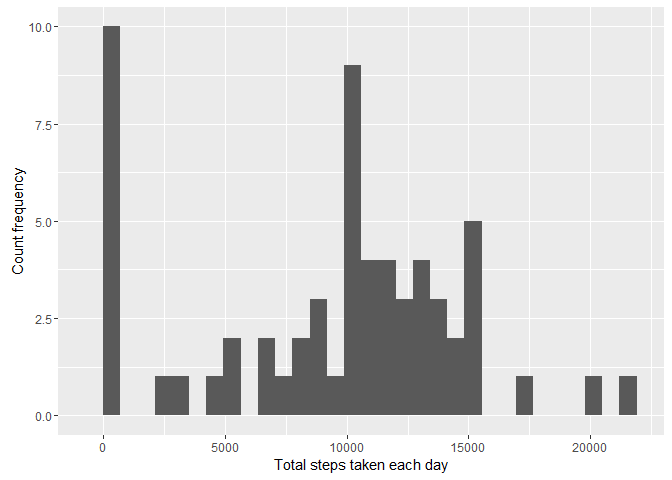
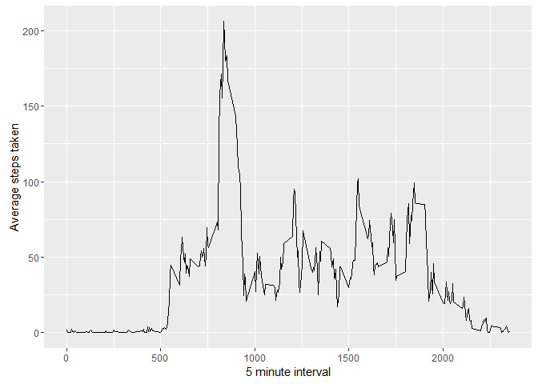
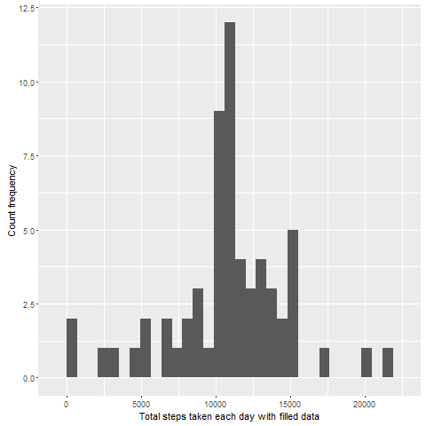
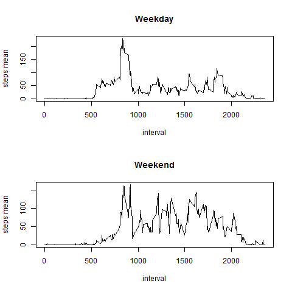

# Reproducible Research: Peer Assessment 1


## Loading and preprocessing the data

This data was downloaded from coursera site and then loaded using the following simple read.csv.


```r
data <- read.csv("activity.csv") 
```

## What is mean total number of steps taken per day?

We can find the total number of steps taken each data by first using a tapply to find the sum of each date


```r
t_steps <- tapply(data$steps, data$date, FUN=sum, na.rm=TRUE)
```
Shown below is a histogram of the resulting data demonstrating the frequency at which each general number of steps is taken.


```r
qplot(t_steps, xlab="Total steps taken each day", ylab="Count frequency") 
```

```
## `stat_bin()` using `bins = 30`. Pick better value with `binwidth`.
```


And finally, we can calculate the mean and median as follows:


```r
mean(t_steps, na.rm=TRUE) 
```

```
## [1] 9354.23
```

```r
median(t_steps, na.rm=TRUE)
```

```
## [1] 10395
```

## What is the average daily activity pattern?

To demonstrate the avergae daily activity we will display a time series plot across the re-occuring 5 minute intervals of each data.  In order to do that we must first create another data set that will average the steps by each interval


```r
avg_steps <- aggregate(x=list(steps=data$steps), by=list(interval=data$interval), FUN=mean, na.rm=TRUE) 
```

We can them display the plot:


```r
ggplot(data=avg_steps, 
       aes(x=interval, y=steps)) + 
       geom_line() + 
       xlab("5 minute interval") + 
       ylab("Average steps taken") 
```



With the following R command we see that the maximum number of steps is usually found in the 08:35 interval with an average of 230 steps.


```r
averages[which.max(avg_steps$steps),] 
```

```
##     interval     day    steps
## 104      835 weekday 230.3782
```

## Imputing missing values

Looking at our data we find 2304 missing values for steps:


```r
sum(is.na(data$steps))
```

```
## [1] 2304
```
Missing values can throw off measurements but we have enough information from our data to make educated guesses about what type of data is typical on a given day interval.  To fill in missing values we will use a quick while loop that will go through each row, test for missing value and then add an average of other observations from that same interval to a new column.


```r
  i <- 1
  while(i <= nrow(data)) {
    if( is.na(data$steps[i]) ) {
      intRow <- data$interval[i]
      data$steps_filled[i] = avg_steps$steps[which(avg_steps$interval==intRow)]
    }   
    i <- i + 1
  }
```
With our new column steps_missing we can now make better demonstrations of some of our previous assertions.  We will create a new aggregation data set using the following code:


```r
t_steps <- tapply(data$steps_filled, data$date, FUN=sum, na.rm=TRUE) 
```

And plot with another histogram.


```r
qplot(t_steps, xlab="Total steps taken each day with filled data", ylab="Count frequency") 
```

```
## `stat_bin()` using `bins = 30`. Pick better value with `binwidth`.
```



## Are there differences in activity patterns between weekdays and weekends?

A useful question that our data could answer is whether or not more steps are taken on weekdays or weekends.  We will add another column to our dataset to hold what type of data eacy observation is.


```r
  day_type <- c("Weekend", "Weekday")
  dow <- function(test_date) {
    day_num <- as.POSIXlt(as.Date(test_date))$wday + 1
    return( ifelse(day_num == 1 || day_num == 7, day_type[1], day_type[2]) )
  }
  data$day_type <- as.factor( sapply(data$date, dow) )
```

With each observation now categorized as a weekday or a weekend we will now pull the data into two datasets.  One for weekdays and one for weekends.


```r
  wkday <- aggregate(steps_filled~interval, data=data, subset=(data$day_type=="Weekday"), FUN = mean)
  wkend <- aggregate(steps_filled~interval, data=data, subset=(data$day_type=="Weekend"), FUN = mean)
```

These two sets can now be compared and the difference between activity types becomes visibly apparant.


```r
  par(mfrow=c(2,1))
  with(wkday, (plot(interval, steps_filled, type="l", ylab="steps mean", xlab="interval", main="Weekday")))
```

```
## NULL
```

```r
  with(wkend, (plot(interval, steps_filled, type="l", ylab="steps mean", xlab="interval", main="Weekend")))
```



```
## NULL
```

